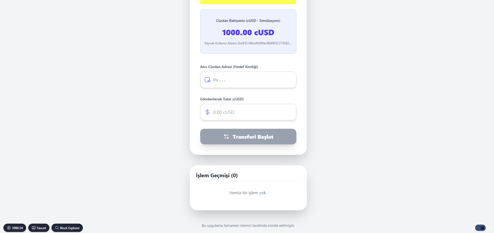
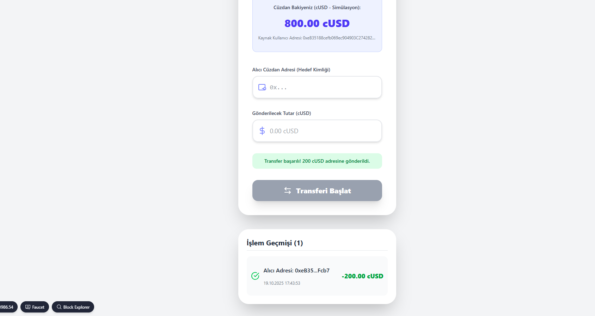
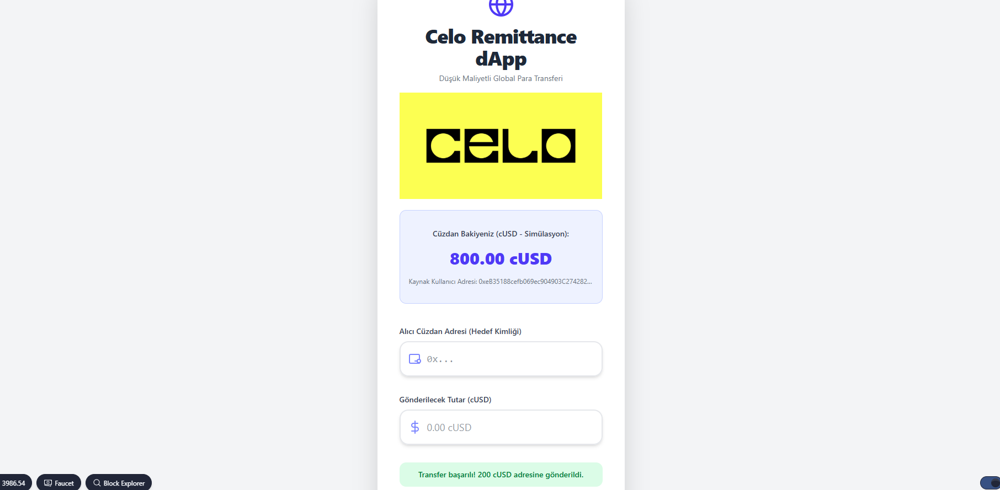

🌍 Project Summary
This Decentralized Application (dApp) simulation aims to optimize international money transfers (remittances) by leveraging the core advantages of the Celo ecosystem. By utilizing low-transaction-cost cUSD stablecoin transfers, the goal is to provide users with a faster, more transparent, and cost-effective transfer experience compared to traditional banking.

✨ Key Features
Financial Inclusion: Designed for users seeking to avoid high transfer fees.

Wallet-Based Transfer: P2P transfer simulation via the recipient's Wallet Address (Wallet ID) instead of a phone number.

Instant Balance Deduction: Upon successful simulated transfers, an immediate deduction is made from the user's cUSD balance, which is maintained in the client-side state.

Transaction History: A history of all performed transfers is listed within the application.

Asset: The transfer of the cUSD (Celo Dollar) stablecoin is simulated.

🛠️ Technologies Used
Backend (Simulation): Solidity, ERC-20 (IERC20) Contract logic, and defining the token transfer flow.

Frontend: React, Next.js, Tailwind CSS for a responsive interface, and mimicking the Scaffold-ETH style.

Business Logic: Client-Side State Management to simulate balance and transaction history without Web3 dependency (due to Canvas constraints).

🚀 Local Setup (For Scaffold-ETH)
Since this project mimics the Scaffold-ETH infrastructure, the following steps are recommended for a real Web3 integration:

Deploy the Contract: Deploy the packages/hardhat/contracts/RemittanceDapp.sol file to your local chain.

Frontend Integration: Replace the packages/nextjs/app/page.tsx file with the provided React code.

Run: Start the chain and the application (yarn chain and yarn start).

Note: For a real balance deduction on a live chain, the connected wallet would first need to perform an Approve transaction on the token contract.

  

  

  

  

