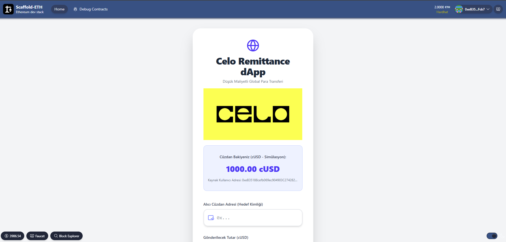

# 🌍 Decentralized Remittance dApp Simulation

This **Decentralized Application (dApp)** simulation aims to optimize international money transfers (remittances) by leveraging the **Celo** ecosystem.  
By utilizing low-transaction-cost **cUSD stablecoin transfers**, the goal is to provide users with a **faster, more transparent, and cost-effective** transfer experience compared to traditional banking systems.

---

## ✨ Key Features

- **Financial Inclusion:**  
  Designed for users seeking to avoid high transfer fees in traditional remittance channels.

- **Wallet-Based Transfer:**  
  Peer-to-peer (P2P) transfer simulation via the recipient’s **Wallet Address (Wallet ID)** instead of a phone number.

- **Instant Balance Deduction:**  
  Upon a successful simulated transfer, the sender’s **cUSD balance** (stored in client-side state) is immediately reduced.

- **Transaction History:**  
  All performed transfers are stored and displayed in the in-app **transaction history** section.

- **Asset:**  
  The simulated transfers utilize **cUSD (Celo Dollar)**, representing stable-value crypto assets within the Celo ecosystem.

---

## 🛠️ Technologies Used

### Backend (Simulation)
- **Solidity**
- **ERC-20 (IERC20)** standard for token behavior
- **RemittanceDapp.sol** contract defines the token transfer logic and events

### Frontend
- **React**
- **Next.js**
- **Tailwind CSS** (for responsive, modern UI)
- Scaffold-ETH inspired UI/UX structure

### Business Logic
- **Client-Side State Management**  
  Used to simulate balances and transaction history **without Web3 dependencies** (due to Canvas constraints).

---

## 🚀 Local Setup (For Scaffold-ETH Integration)

Since this project mimics **Scaffold-ETH** architecture, follow these steps for full Web3 integration:

1. **Deploy the Smart Contract**
   ```bash
   cd packages/hardhat
   npx hardhat run scripts/deploy.js --network localhost

<div align="center">
  
</div>
<div align="center">
  
</div>
<div align="center">
  
</div>
<div align="center">
  
</div>
